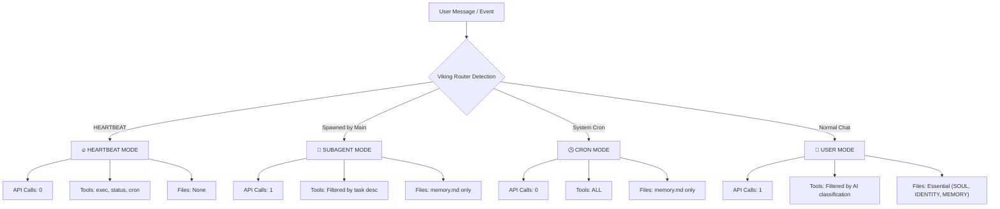

# Viking Router for OpenClaw 🚀

[](https://opensource.org/licenses/MIT)
[](https://github.com/chengazhen/cursor-auto-rules)
[]()

> [Read in Chinese (中文文档)](./README_CN.md)

**A smart, token-saving router plugin for OpenClaw.** 

Viking Router uses a lightweight LLM (like the free `gemini-2.5-flash-lite`) to classify every incoming message and dynamically filter the tools and context files injected into OpenClaw's prompt. 

By only loading what's strictly necessary for each task, it dramatically reduces your primary LLM's token consumption and cost without sacrificing capabilities.

Inspired by [OpenViking's](https://github.com/volcengine/OpenViking) L0/L1/L2 layered context paradigm.

## ✨ Why You Need This

Out of the box, OpenClaw injects **all 21+ tools** and **all workspace files** into its system prompt for *every* message, consuming roughly **~15k input tokens** just for a simple "Hello".

With **Viking Router v2**:
- 🗣️ **Casual Chat:** Irrelevant tools are stripped. Full schemas are replaced with lightweight one-line summaries. **(~65% savings)**
- 💓 **Heartbeats:** Zero API routing calls. Instantly drops all context files and leaves only 3 essential tools. **(~93% savings)**
- 🤖 **Subagents:** Routes tools based on the subagent's specific task description. Keeps only `memory.md`. **(~70% savings)**
- 🕒 **Cron Tasks:** Bypasses routing to ensure scheduled tasks never break, but still filters heavy context files. 

## 🧠 How It Works (Smart Routing Flow)



## 📦 Installation

### 1. Clone into your OpenClaw installation
Run this from the root of your OpenClaw directory:
```bash
git clone https://github.com/13579x/openclaw-viking-router.git patches/viking-router
```

### 2. Configure your API Key
Copy the example config:
```bash
cp patches/viking-router/config/viking-config.example.json patches/viking-config.json
```
Edit `patches/viking-config.json` and add your routing model API key (We highly recommend Google's free `gemini-2.5-flash-lite`):
```json
{
    "enabled": true,
    "baseUrl": "https://generativelanguage.googleapis.com/v1beta/openai",
    "modelId": "gemini-2.5-flash-lite",
    "apiKey": "YOUR_API_KEY_HERE"
}
```

### 3. Apply the patch
```bash
node patches/viking-router/install.js
```

### 4. Restart OpenClaw
Restart your OpenClaw gateway for the changes to take effect.

---

## 🛡️ Future-Proofing (Auto-Patch)

OpenClaw updates (`npm update`) will overwrite the core files, removing the Viking patch. 
To ensure Viking Router reinstalls itself automatically, add a `postinstall` script to your OpenClaw `package.json`:

```json
{
  "scripts": {
    "postinstall": "node patches/viking-router/install.js"
  }
}
```

## 🔧 Supported Routing Models

We strongly suggest using a fast, free, or extremely cheap model for routing, as it adds a slight latency (1-3s) to user messages.

| Model | Provider | Free Tier? | Speed |
|-------|----------|------------|-------|
| `gemini-2.5-flash-lite` | Google AI Studio | ✅ Yes! | ⚡ ~2-3s |
| `gemini-2.0-flash` | Google AI Studio | ✅ Yes! | ⚡ ~2-3s |
| `gpt-4o-mini` | OpenAI | ❌ No | ⚡ ~1-2s |
| `deepseek-chat` | DeepSeek | ❌ No (but cheap) | ⏳ ~3-5s |
| Any *OpenAI-Compatible* API | Local / Others | Varies | Varies |

## ⚙️ Configuration File (`viking-config.json`)

| Field | Description |
|-------|-------------|
| `enabled` | Set to `false` to instantly bypass routing without uninstalling. |
| `baseUrl` | Your OpenAI-compatible endpoint URL. |
| `modelId` | The string identifier of the routing model. |
| `apiKey` | Your authentication token. |
| `maxTokens` | Max tokens for the routing model's JSON response (100 is plenty). |
| `temp` | Temperature for routing model (0 is highly recommended for stable JSON). |

*Note: You can also use environment variables (`VIKING_API_KEY`, `VIKING_MODEL`, `VIKING_BASE_URL`, `VIKING_ENABLED`) which will override the JSON config.*

## 🗑️ Uninstall

If you ever need to completely remove the router and restore your original OpenClaw files:
```bash
node patches/viking-router/uninstall.js
```

## 📄 License
MIT
