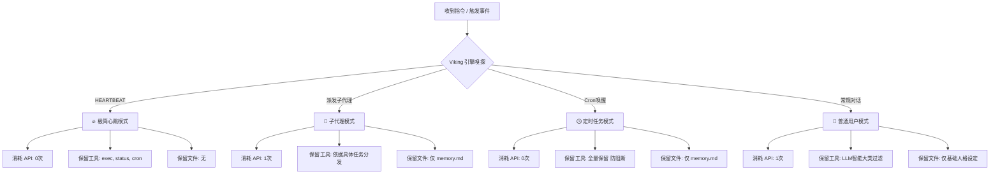

# Viking Router for OpenClaw 🚀

[](https://opensource.org/licenses/MIT)
[](https://github.com/chengazhen/cursor-auto-rules)
[]()

> [阅读英文文档 (Read in English)](./README.md)

**一款专为 OpenClaw 设计的智能、省 Token 的路由分流插件。**

Viking Router 使用轻量级 LLM（推荐免费的 `gemini-2.5-flash-lite`）对每一条传入消息进行意图分类，并动态过滤注入到 OpenClaw 提示词中的工具列表和上下文文件。

通过按需加载，它能在完全不牺牲代理能力的前提下，**大幅降低主模型的 Token 消耗和高昂的账单成本。**

*设计灵感来源于字节跳动 [OpenViking](https://github.com/volcengine/OpenViking) 提出的 L0/L1/L2 分层上下文范式。*

## ✨ 核心痛点与解决

默认情况下，OpenClaw 会对**每一条消息**（哪怕只是打个招呼）暴力注入**全部的 21 个工具 Schema** 以及所有的 Workspace 文件描述，单次 Input Token 消耗高达 **~15k**。

**安装 Viking Router v2 后：**
- 🗣️ **日常聊天：** 自动剔除无关工具，未加载的工具退化为单行文本摘要（L0模式）。**（节省 ~65% Token）**
- 💓 **心跳轮询 (Heartbeats)：** 0 API 调用感知。彻底清空文件注入，仅保留 3 个核心运维工具。**（节省 ~93% Token）**
- 🤖 **子代理任务：** 读取派发给子代理的具体任务描述，精准投放所需工具；强力截断无关系统提示词（仅保留 `memory.md`）。**（节省 ~70% Token）**
- 🕒 **Cron 定时任务：** 智能放行全部工具以保证任务不中断，但依然清理冗余的文件上下文。 

## 🧠 四路智能分流引擎



## 📦 极速安装指南

### 1. 克隆进入 OpenClaw 目录
在你的 OpenClaw 根目录下运行：
```bash
git clone https://github.com/13579x/openclaw-viking-router.git patches/viking-router
```

### 2. 配置 API Key
复制配置模板：
```bash
cp patches/viking-router/config/viking-config.example.json patches/viking-config.json
```
编辑 `patches/viking-config.json`，填入用于路由的 LLM API 及密钥（强烈推荐 Google AI Studio 免费提供的 Gemini）：
```json
{
    "enabled": true,
    "baseUrl": "https://generativelanguage.googleapis.com/v1beta/openai",
    "modelId": "gemini-2.5-flash-lite",
    "apiKey": "替换为你的_API_KEY"
}
```

### 3. 应用注射补丁
```bash
node patches/viking-router/install.js
```

### 4. 重新启动服务
重启 OpenClaw Gateway 即可生效。

---

## 🛡️ 防止更新覆盖

当你运行 `npm update` 升级 OpenClaw 时，核心文件会被覆盖，导致补丁失效。
为了一劳永逸，建议在 OpenClaw 根目录的 `package.json` 中添加 `postinstall` 钩子：

```json
{
  "scripts": {
    "postinstall": "node patches/viking-router/install.js"
  }
}
```

## 🔧 路由模型推荐

由于这会为一次完整的对话额外增加一个前置判断，**严重推荐使用响应极快、免费且包含并发额度的模型。**

| 模型 | 提供商 | 是否免费 | 响应延迟 |
|-------|----------|------------|-------|
| `gemini-2.5-flash-lite` | Google AI Studio | ✅ 免费且充裕 | ⚡ ~2-3s |
| `gemini-2.0-flash` | Google AI Studio | ✅ 免费且充裕 | ⚡ ~2-3s |
| `gpt-4o-mini` | OpenAI | ❌ 收费 | ⚡ ~1-2s |
| `deepseek-chat` | DeepSeek | ❌ 收费 (便宜) | ⏳ ~3-5s |
| 任何 *OpenAI-Compatible* API | 本地模型或聚合商 | 视情况而定 | 视情况而定 |

## ⚙️ 配置说明 (`viking-config.json`)

| 字段 | 说明 |
|-------|-------------|
| `enabled` | 紧急开关：填 `false` 立刻停用路由且无需卸载补丁。 |
| `baseUrl` | 兼容 OpenAI 格式的 API URL 端点。 |
| `modelId` | 路由模型的标准名称字符串。 |
| `apiKey` | 鉴权令牌。 |
| `maxTokens` | 路由输出是简短的 JSON，此处设为 `100` 即绰绰有余。 |
| `temp` | LLM Temperature，推荐定死为 `0` 获得稳定不抽风的 JSON 格式。 |

*注：你也可以通过设置环境变量（如 `VIKING_API_KEY`）来覆盖 JSON 里的设定，非常适合 Docker 部署。*

## 🗑️ 无痕卸载

需要完全移除插件影响，恢复所有 OpenClaw 原始文件时：
```bash
node patches/viking-router/uninstall.js
```

## 📄 开源许可证
MIT
